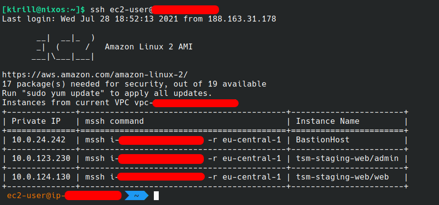

# aws-cloud-instance-list

Console command which show all instances from current VPC.
This command uses in bastion host for show list of instances and connection using this data to another instance in private network.



## Install
```bash
pip3 install aws-cloud-instance-list
```

To bastion instance need add managed role `AmazonEC2ReadOnlyAccess`

For using `mssh` need add to instance policy

```json
{ "Version": "2012-10-17", "Statement": [{"Condition": {"StringEquals": {"aws:ResourceTag/<tag-key>": "<tag-name>"}}, "Action": "ec2-instance-connect:SendSSHPublicKey", "Resource": "arn:aws:ec2:<region>:<profile_id>:instance/*", "Effect": "Allow"}]}
```

## Update
```bash
pip3 install aws-cloud-instance-list --upgrade
```

## Deploy to pypi

```
python setup.py register -r pypi
python setup.py sdist upload -r pypi
```

#### Check readme
```
python -m readme_renderer README.md -o /tmp/README.html
```
